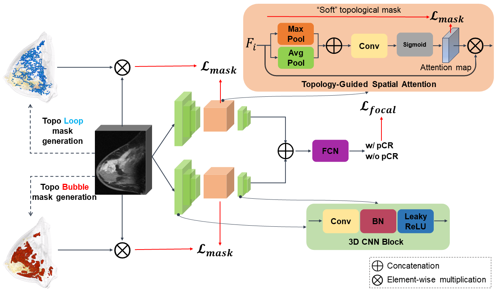
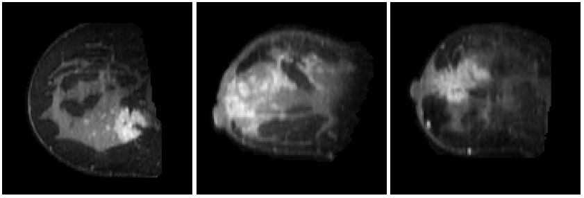

# TopoTxR: A topology-guided deep convolutional network for breast parenchyma learning on DCE-MRIs #

## Overview
This repo provides the PyTorch implementation of our paper in Medical Image Analysis 2024. TopoTxR explicitly extracts multi-scale topological structures to better approximate breast parenchymal structures and then incorporates these structures into a deep-learning-based prediction model via an attention mechanism. Our topology-informed deep learning model, **TopoTxR**, leverages topology to provide enhanced insights into tissues critical for disease pathophysiology and treatment response. **TopoTxR** achieves **state-of-the-art performance** on the I-SPY 1 dataset for pCR prediction. The pipeline is shown as the following:


## Dataset
We provide the samples of the processed I-SPY 1 dataset and the corresponding topological masks in `Sample_data.zip`. Please download the original I-SPY 1 dataset from their official [website](https://www.cancerimagingarchive.net/collection/ispy1/). All 3D inputs have been uninformed into `256*256*256`. For instance, slices from I-SPY 1 samples are presented as follows:


## Getting Started 
The code has been verified on Python 3.8 with PyTorch 1.8.1. You can also install the required packages with:

```bash
pip3 install torch==1.8.1+cu111 torchvision==0.9.1+cu111 torchaudio==0.8.1 -f https://download.pytorch.org/whl/torch_stable.html
```
or with our provided `environment.yml` as :

```bash
conda env create -f environment.yml -n your_env_name
```

### Training and Validation ###
Before running the program, here are a few parameters you might want to change:

`Archpool.ipynb/return_settings()`:
- branch_name: the name of the pytorch log folder to put saved models
- continue_model: train from the saved checkpoint
- model_step: if continue_model is True, specifiy the step you want to to continue training from
- save_path: the path to put the pytorch log folder
- ori_path: path to your original MRIs (like the file structure in `Sample_data.zip`)
- data_path: path to your topological masks belong to the 1-dimensional cubical complexes (like the file structure in `Sample_data.zip`)
- data_path2: path to your topological masks belongs to the 2-dimensional cubical complexes (like the file structure in `Sample_data.zip`)
- print_step: interval of steps you want to apply validation
- save_step: interval of steps you want to save the checkpoints

`Archpool.ipynb/return_data_settings()`:
- epochs: training epochs
- batch_size: training batch size
- extra_aug: whether add the extra augmented data from 'extra_path_xxx' in `return_settings()`
- xfold: number of cross-validation folds
- fold_idx: the specific fold in cross-validation

Go to `Examples.ipynb` and hit run button. This file will run the code in `CNN_attention.ipynb` for cross-validation in one fold.
